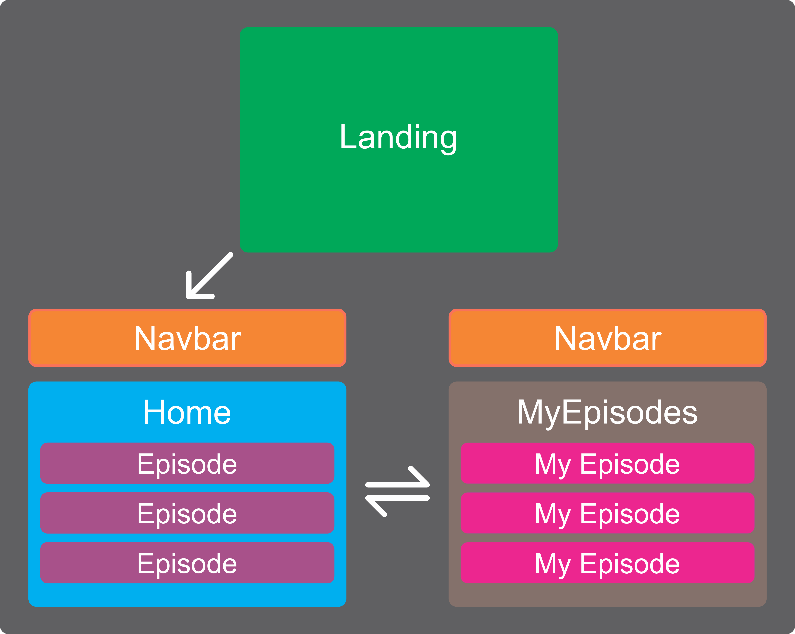

# Módulo 2 | REPASO |

## Cohorte FT42b - 14/09/2023

### Idea general del proyecto

### Temas que repasaremos:
- React
  - Componentes de clase y funcionales
  - Estados y props
  - React-Router-DOM
  - Formularios
- Redux
- Hooks

### Componentes a desarrollar:
- Landing: Vista de Bienvenida.
  - Permitirá ingresar el nombre y email del usuario y guardarlo en un estado local.
- NavBar: Mostrará el nombre del usuario y los link de navegación.
  - No debe renderizarse en Landing.
- Home: Cargará los episodios en un estado local.
  - Para ello utilizaremos el endpoint de la [API Rick&Morty](https://rickandmortyapi.com/api/episode).
- Card: Renderizará la información de cada uno de los episodios.
  - Permitirá que un episodio sea cargado a un estado global de Redux "Favoritos".
  - A los datos de cada episodio agregaremos las propiedades:
    - "completed": que tendrá un valor de false al inicio
    - "rating".: que tendrá un valor inicial de 3
- Favorites: Muestra los episodios cargados en el estado global de "Favoritos".
  - Permite modificar la propiedad "completed" a true.
  - Permite modificar el "rating" entre 1 y 5.
- Detail: Muestra más información sobre el episodio favorito seleccionado.